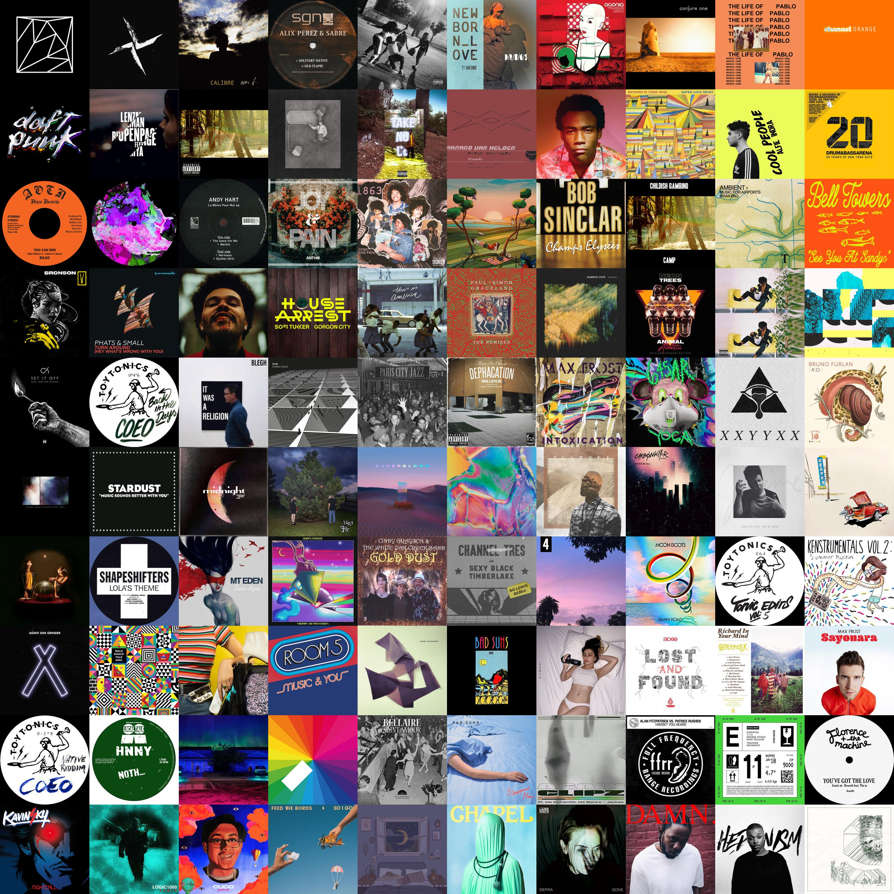

# LastFM Colours

Generates a collage of your top 100 albums from the last month and groups the roughly by colour.

To run, create a file called `key` with your LasmFM API key in it. Install the dependencies and then run `main.py`

